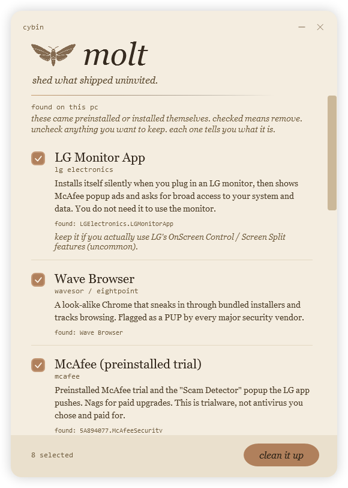
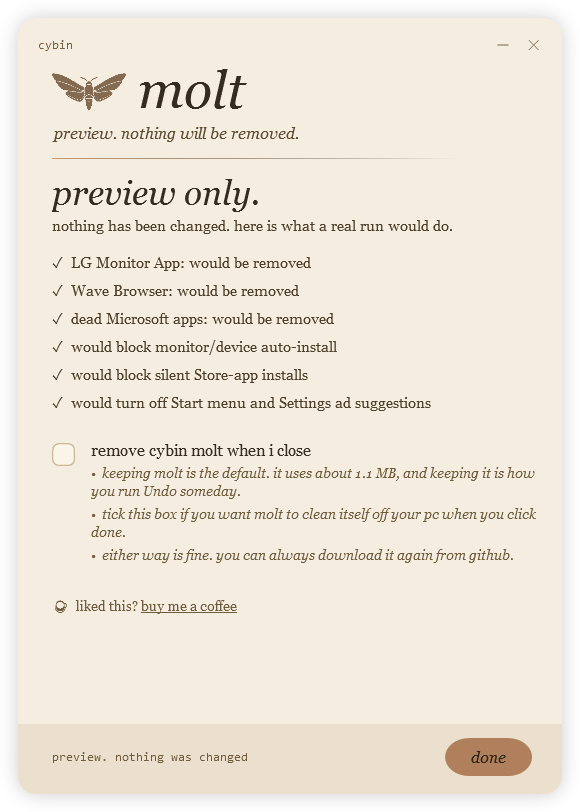

# molt

**Shed what shipped uninvited.** A small, readable tool by [Cybin](https://nina-cybin.fly.dev) that removes bloatware, scamware and the junk Microsoft and PC makers preload, then locks Windows so it cannot quietly come back.

Plug in an LG monitor and Windows silently installs an "LG Monitor App" that throws McAfee popup ads and asks for broad access to your system. Dell, Alienware, HP and Lenovo machines pull the same trick with their own junk. Free downloads smuggle in fake browsers and fake antivirus. Microsoft preloads dead apps, ad feeds and sponsored tiles. Molt finds that stuff, shows you exactly what each thing is, lets you pick what to remove, and then shuts the door Windows leaves open.



## The LG monitor thing (July 2026)

If you got here searching "why did an LG Monitor App install itself" or "McAfee popup after plugging in an LG monitor", this is the tool for that. Plug an LG UltraGear or Smart Monitor into Windows 11 and Windows Device Setup Manager quietly pulls LG's companion app (`LGElectronics.LGMonitorApp`) from the Store using device metadata. For a lot of people the first sign it exists is a McAfee ad. Tom's Hardware, TechSpot and others covered it in July 2026, and the same silent install trick has been reported with Alienware and ASUS monitor apps too.

Molt removes the LG Monitor App and the McAfee trialware it promotes, then flips the Windows setting so plugging in hardware stops auto installing manufacturer apps at all. That is the "stop surprise apps from new devices" switch, and `Undo.bat` reverses it any time.

## What it does

1. **Scans** your PC for known preinstalled junk.
2. **Shows you a checklist.** Every item has a plain language note explaining what it actually is, plus a "keep it if" line. Nothing is removed without you seeing it and okaying it.
3. **Cleans** the items you leave checked.
4. **Locks Windows down** with three switches: plugging a device back in will not silently reinstall anything, Windows stops dropping sponsored apps on you, and the "suggested" app ads in your Start menu and Settings turn off. (Your Spotlight wallpapers and pins stay untouched.)
5. **Can remove itself** when it is done (unticked by default). The lock keeps the junk out either way; keeping molt around is simply how you run Undo someday.

## How to use it

1. Download the latest release and unzip it anywhere.
2. Double click **`Run.bat`**.
3. Click **Yes** at the Windows admin prompt. It needs admin to remove apps for every user and to set the protection.
4. Review the checklist, then click **clean it up**. A progress bar walks through each item, and you get a plain receipt at the end:



Changed your mind about the protections later? Double click **`Undo.bat`** to set them back to how Windows had them. Want to look before you leap? Run `Run.bat -WhatIf` for a preview that changes nothing.

> **"Windows protected your PC" warning?** That is SmartScreen flagging any app that is not from a big signed vendor. Molt is free and unsigned on purpose. it is a plain, readable PowerShell script you can open and inspect. Click **More info**, then **Run anyway**, or read `Molt.ps1` and `src/` first. That transparency is the whole point of an anti spyware tool.

## What it removes (and what it will not)

| Removes (you can uncheck any) | Leaves alone, always |
| --- | --- |
| **Scamware that infects people:** OneLaunch, Wave Browser, RAV "antivirus" and its Online Security add-on (ReasonLabs), Restoro / Reimage fake fixers (FTC fined them $26M), driver updater junk, Bing Wallpaper (caught reading browser cookies) | **Logitech G HUB.** it starts with "LG" but it is yours |
| **Preinstalled AV trials:** McAfee, Norton | **Waves MaxxAudio,** your real audio software (not Wave Browser) |
| **Dead Microsoft apps:** Cortana, Skype, old Mail and Calendar, Maps, Dev Home, the old Teams and friends | **Windows Security, the Store, winget, Edge, OneDrive** |
| **Microsoft push-ware:** Copilot, Bing News, the MSN feed engine, the Microsoft 365 nag hub, PC Manager, Tips | **Photos, Camera, Calculator, Notepad, Terminal, Snipping Tool, Media Player, Weather** |
| **Sponsored tiles:** TikTok, Instagram, Facebook, LinkedIn, Amazon, Candy Crush and friends | **The new Teams (MSTeams)** and anything you use for work |
| **OEM junk:** LG Monitor App, Dell SupportAssist and extras, SmartByte, HP promo apps, Lenovo Vantage, Acer Care Center, ASUS GiftBox | **Dell Update / Command Update,** the real driver updater |
| **Unchecked by default (real uses, your call):** Xbox apps, Quick Assist, streaming tiles (Spotify, Netflix...), Phone Link, To Do, OneNote, new Outlook, Clipchamp, Solitaire, Widgets, Alienware Command Center, MSI Center, MyASUS and friends, ExpressVPN | **Any CPU or GPU driver,** never touched. **MSI Afterburner and Armoury Crate** too |
| | **HP Support Assistant and printer software** |
| | Anything not on the exact list in `data/catalog.psd1` |

**How it stays safe.** Molt only ever acts on an **exact, full string, case insensitive** match against a hand checked list in `data/catalog.psd1`. It never matches on substrings, so "LG" can never reach Logitech's `LGHUB` and "Wave Browser" can never reach your Waves audio software. Generic sounding names (like ReasonLabs' "Online Security") are only allowed in when the registry **publisher matches exactly too**, so nobody else's app with the same name can ever be touched. Every entry is marked `Verified` before it is allowed to remove anything, risky items arrive **unchecked**, and every card shows the exact package names it found. The whole matcher is covered by 150+ safety tests (`tests/detect.tests.ps1`), including ones that prove Logitech, Windows Security, the Store, winget, WSL, MSI Afterburner, Intel's driver assistant and Dell's real updater are never targets.

## Requirements

Windows 10 or 11. No install, no dependencies. it uses PowerShell and .NET, which ship with Windows.

## For the curious

```
molt/
  Run.bat / Undo.bat      one click launchers
  Molt.ps1                entry point (self elevates, then opens the window)
  data/catalog.psd1       the list of junk plus honest descriptions
  src/detect.ps1          the exact match engine and scanner
  src/remove.ps1          removal (Store apps and Win32 uninstallers)
  src/lockdown.ps1        the protection toggles (and undo)
  src/gui.ps1             the window
  tests/detect.tests.ps1  safety tests. run them: powershell -File tests\detect.tests.ps1
```

Found bloatware Molt misses? The catalog is easy to extend, one hand verified entry per offender. See the TODO note at the bottom of `data/catalog.psd1` for the next batch (ASUS, MSI Center and a few HP stubs that need exact identifiers from real machines).

## Support

If Molt saved you a headache, you can [buy me a coffee](https://buymeacoffee.com/MowingDevil). Thank you.

## License

MIT. See [LICENSE](LICENSE).
